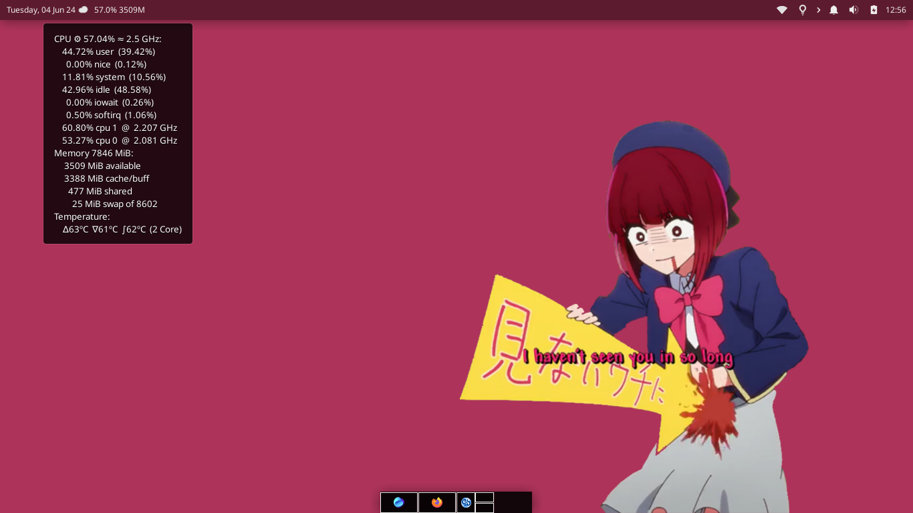
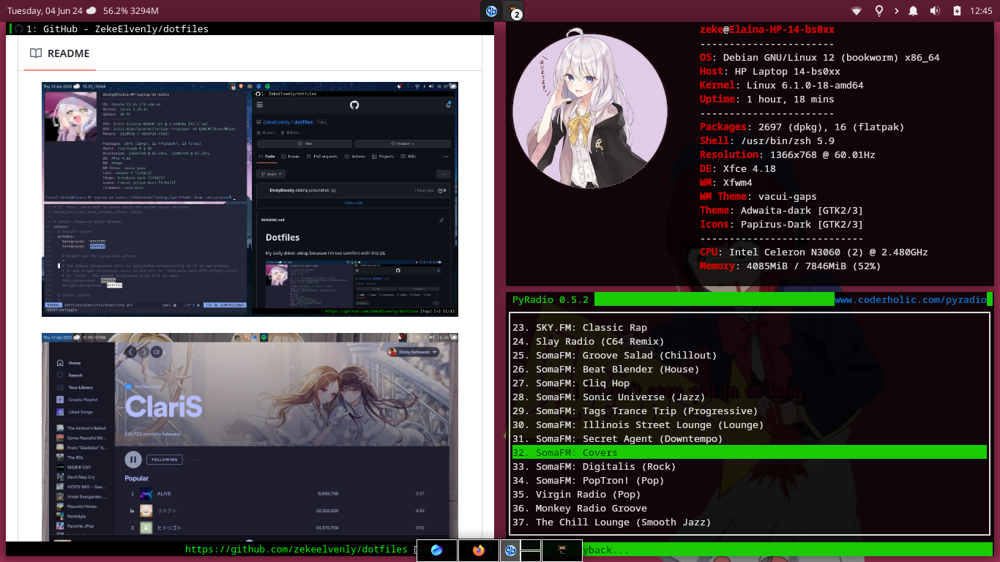
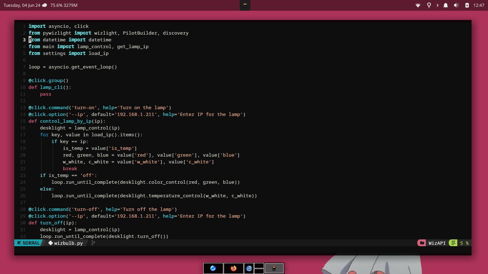

# Dotfiles

My daily driver setup because i'm too comfort with this DE

## Screenshots

## The Spices

Distro : Debian 12 Stable

DE : XFCE 4.18

WM : XFWM4

WM Theme : [Self-made no border gaps theme](themes/vacui-gaps/xfwm4)

Theme : Adwaita-dark

Wallpaper : Arima Kana from Oshi no Ko Eps.3 `(Actually i forgot which eps is)`

Icon : [Papyrus-Dark](https://github.com/PapirusDevelopmentTeam/papirus-icon-theme)

In-Panel System Monitor : [xfce-hkmon](https://lightful.github.io/xfce-hkmon/)

Browser : [Qutebrowser](https://qutebrowser.org/)

Radio : [Pyradio](https://github.com/coderholic/pyradio)

